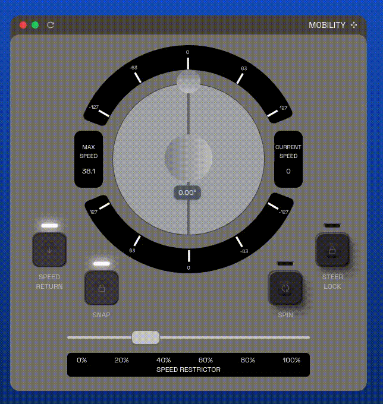

# [Lollipop](https://www.youtube.com/watch?v=6md5RSnVUuo)

One essential feature of every rover, is the ability to traverse terrain. Sometimes is useful for the Astronaut to be able to move it.

Francesco, our beutiful designer decided that the control module needs to look like the one pictured above.

## Instructions 
Code the module in the preferred language, trying to make it as close as you can to the reference provided.

## Challenge's score
Total score: 500
