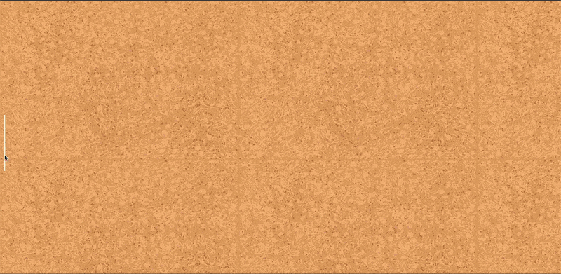

# [Stuck On You](https://www.youtube.com/watch?v=PozM4bs-g7s)

Create an interactive corkboard where users can drag and drop sticky notes (pins) onto the board. The interface should be well designed. Users should be able to add multiple sticky notes and reposition them by dragging. 

## Instructions
Please develop a web application that allows users to interact with a corkboard interface. The corkboard should have the following features:

- A visually pleasing corkboard interface where users can drag and drop notes. 
- Smooth, well-integrated CSS animations that enhance the drag-and-drop 
experience. 
- Multiple pins can be added, moved, and removed seamlessly. 

## Expected deliverables
- All the necessary code and optionally instructions on how to run the application.

## Challenge's Score: 

Total score: 500
- 200 Points: Full drag-and-drop functionality with the ability to remove notes. 
- 300 Points: Include CSS animations, a well-designed interface, and 
customization options for pins. 
 
Feel free to add new functionalities. We will appreciate that!