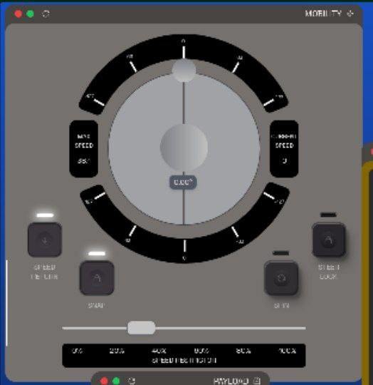

# [Lollipop](https://www.youtube.com/watch?v=6md5RSnVUuo)

One essential feature of every rover, is the ability to traverse terrain. Sometimes is useful for the Astronaut to be able to move it.

Francesco, the beutiful designer decided that the control module needs to look like this:

## Instructions 
Code the module in the preferred language.

## Challenge's score
Total score: 400